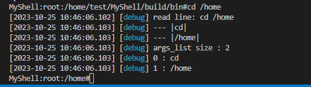

# MyShell

## install

### compile

```shell
# 下载第三方库
$ apt install cmake
$ apt install libspdlog-dev

# 编译
$ mkdir build
$ cd build
$ cmake ..
$ cmake --build .
$ make install
```

## options

* -v, --version : 显示版本
* -h, --help      : 显示帮助

## examples

```shell
$ MyShell -v   # 查看版本
```


```shell
$ MyShell -h    # 显示帮助
```


```shell
$ MyShell      # shell framework
```


```shell
$ cd /home     # 更改工作路径
```



```shell
$ help        # 显示帮助
```


```
$ # 命令
$ MyGrep --version
$ MyGrep -s make -d ./
```


