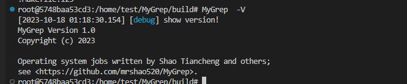
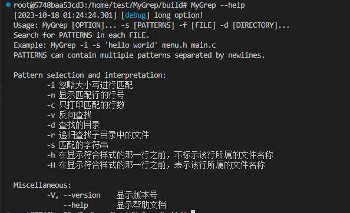
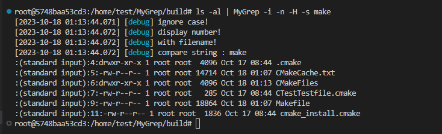
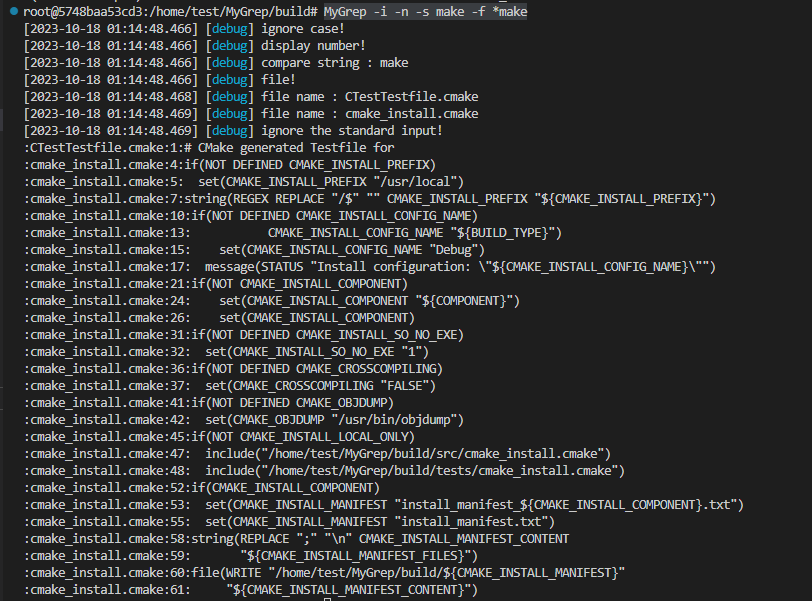
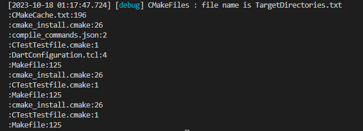

# MyGrep

## install

### 编译

```shell
# 下载第三方库
$ apt install cmake
$ apt install libspdlog-dev

# 编译
$ mkdir build
$ cd build
$ cmake ..
$ cmake --build .
```

## options

*  -i : 忽略大小写进行匹配
*  -n : 显示匹配行的行号
*  -c : 只打印匹配的行数
*  -v : 反向查找
*  -f :  查找的文件
*  -d : 查找的目录
*  -r : 递归查找子目录中的文件
*  -s : 匹配的字符串
*  -h : 在显示符合样式的那一行之前，不标示该行所属的文件名称。
*  -H : 在显示符合样式的那一行之前，表示该行所属的文件名称。
*  -V，--version ： 显示版本
*  --help ： 显示帮助

## examples

```shell
MyGrep -V
```



```
MyGrep --help
```



```shell
ls -al | MyGrep -i -n -H -s make
```



```shell
MyGrep -i -n -s make -f *make
```



```shell
MyGrep -i  -s make -d ./ -r -c
```

